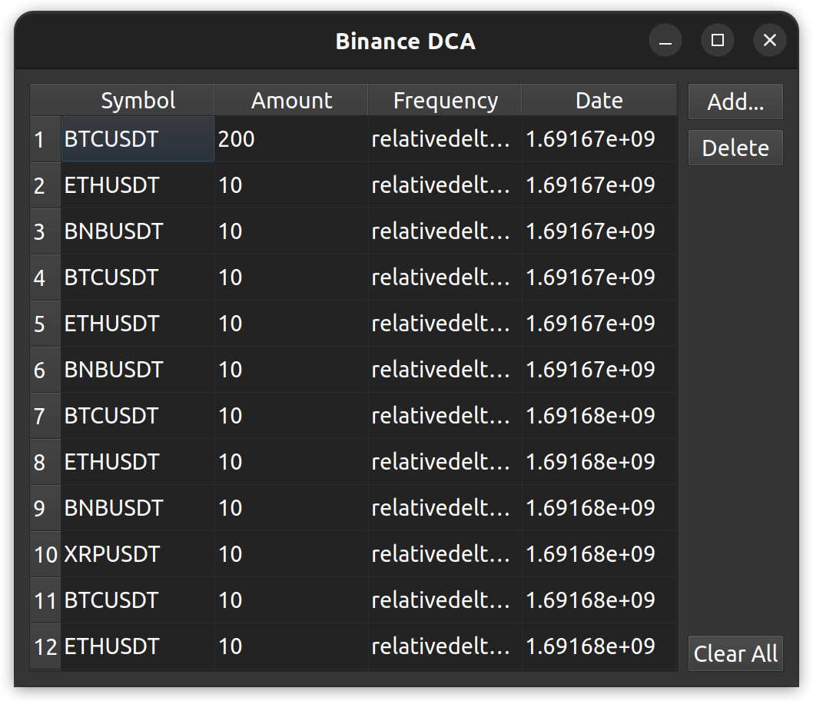

[](https://freepalestine.dev)
# Binance Dollar cost averaging (DCA) 
[](https://github.com/HemaZ/binance-dca/actions/workflows/python-package.yml)

This Package serves as an easy to use/setup python package to schedule market buy orders with a pre defined frequency. 



## DCA 

> Dollar cost averaging (DCA) is an investment strategy that aims to apply value investing principles to regular investment. The term was first coined by Benjamin Graham in his book The Intelligent Investor. Graham writes that dollar cost averaging "means simply that the practitioner invests in common stocks the same number of dollars each month or each quarter. In this way he buys more shares when the market is low than when it is high, and he is likely to end up with a satisfactory overall price for all his holdings."

From Wikipedia, the free encyclopedia

## How to use 

### Simple Example

```python
from ba_dca.dca import DCA
from ba_dca.order import Order,Frequency
dca = DCA()
# Create Two orders which has same start time, but different frequency
order1 = Order("BTCUSDT", 10, Frequency.DAILY)
order2 = Order("ETHUSDT", 10, Frequency.WEEKLY)
dca.add_order(order1)
dca.add_order(order2)
dca.run()
```

```console
>>> 
Executing new order
[{'price': '29113.07000000', 'qty': '0.00034300', 'commission': '0.00000000', 'commissionAsset': 'BTC', 'tradeId': 280829}]
Executing new order
[{'price': '1821.89000000', 'qty': '0.00548000', 'commission': '0.00000000', 'commissionAsset': 'ETH', 'tradeId': 157282}]
Executing new order
[{'price': '29113.07000000', 'qty': '0.00034300', 'commission': '0.00000000', 'commissionAsset': 'BTC', 'tradeId': 280830}]
Executing new order
[{'price': '1821.89000000', 'qty': '0.00548000', 'commission': '0.00000000', 'commissionAsset': 'ETH', 'tradeId': 157288}]
Executing new order
[{'price': '29113.07000000', 'qty': '0.00034300', 'commission': '0.00000000', 'commissionAsset': 'BTC', 'tradeId': 280833}]
Executing new order
[{'price': '1821.89000000', 'qty': '0.00548000', 'commission': '0.00000000', 'commissionAsset': 'ETH', 'tradeId': 157292}]

```

### Custom frequency

```python
from ba_dca.dca import DCA
from ba_dca.order import Order,Frequency
from datetime import datetime
from dateutil.relativedelta import relativedelta
dca = DCA()
# Create an order which will be executed with frequency (1 month + 1 week + 2 days)
freq1 = relativedelta(days=+2,weeks=+1,months=1)
order1 = Order("BTCUSDT", 10, freq1)
dca.add_order(order1)
dca.run()
```
